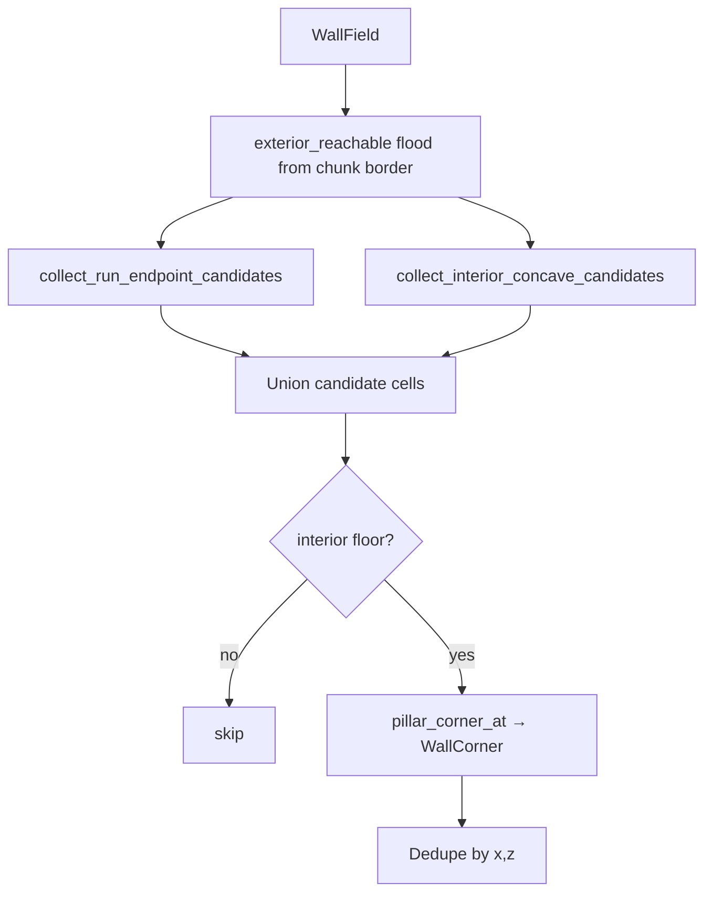

# Inner corner pillars (`c*`)

Agent checklist: **`.claude/SKILLS/map-generator/SKILL.md`** (pipeline step 8), **`.claude/SKILLS/bevy-engineer/SKILL.md`** (wall scale / meshing). Token encoding: **`docs/tilemap.md`** § Corner pillar.

## Problem

Union building footprints are outlined with **wall bitmask cells** on the outer shell
(see [`map-generator.md`](map-generator.md) § Building footprint). On a **convex**
outer corner, one perimeter cell carries **two bits** (e.g. `MASK_NORTH | MASK_WEST` →
`w9`), so two thin slabs meet in the same 1 m tile.

On a **concave (re-entrant)** inner corner—where two room blobs meet in an L, T, or
U—the floor cell *inside* the elbow is open road, but the two wall runs that form the
notch do not share a single multi-bit wall cell. Without a fill, the mesher leaves a
visible gap between slabs.

**Corner pillar** tiles (`c7` / `c9` / `c1` / `c3`) place a small vertical post
(`WALL_THICKNESS`² footprint, full `HYPERMAP_WALL_HEIGHT`) in one corner of that floor
cell. See [`tilemap.md`](tilemap.md) for tokens and world XZ placement.

| Situation | Tile type |
|-----------|-----------|
| Convex outer shell corner | Multi-bit `Wall` on perimeter (no `c*`) |
| Concave union inner elbow | `Corner(WallCorner)` on interior `Open` |
| Hand-placed pillar | Map editor **Corner** brush |

Do **not** put `c*` on the four vertices of a rectangle and single-edge walls between
them—that layout gaps at every corner (documented in the map-generator skill).

## Where it runs

| Stage | Location |
|-------|----------|
| Procedural pipeline step 8 | [`step_corners.rs`](../src/map/map_generator/step_corners.rs) → `step_stamp_union_inner_corner_pillars` |
| Detection (walls only) | [`corner_pillars.rs`](../src/map/map_generator/corner_pillars.rs) → `detect_corner_pillars` |
| Public API | [`map_generator/mod.rs`](../src/map/map_generator/mod.rs): `WallField`, `CornerPillarPlacement`, `detect_corner_pillars` |
| Finish → chunk | [`draft.rs`](../src/map/map_generator/draft.rs) `DraftTile::Corner` → `CellType::Corner` |
| Meshing | [`hypermap_world.rs`](../src/map/hypermap_world.rs) (same passability / wall layer as slabs) |

Order in `MapDraft::run_pipeline`: after `step_build_union_outer_walls`, before
`step_place_union_door`.

Stamping only overwrites **`DraftTile::Open`**—existing `Wall` cells are left alone.

## Input: `WallField`

Detection does **not** use room rectangles or union metadata. Step 8 builds a
`WallField`: per-cell `Option<u8>` wall masks copied from the draft grid (`None` = not
a wall).

Wall orientation for scans:

- **Horizontal** — mask has `MASK_NORTH` or `MASK_SOUTH`
- **Vertical** — mask has `MASK_EAST` or `MASK_WEST`

A cell with both (multi-bit corner wall) participates in **both** run scans.

## Algorithm (`detect_corner_pillars`)

High-level flow:



### 1. Exterior flood fill

`exterior_reachable` marks every non-wall cell reachable from the grid border without
crossing walls. Candidates on exterior “road” carpet are dropped later so run endpoints
on the outside of the shell do not get pillars.

### 2. Run endpoint candidates

Scan each row for contiguous **horizontal** wall runs; add the open cell **before**
`x0` and **after** `x1` on that row. Scan each column for **vertical** runs the same
way (`z0 - 1`, `z1 + 1`).

This catches elbows where a shelf or stub ends next to a perpendicular wall segment.

### 3. Interior concave candidates

For every interior floor cell (not wall, not exterior), check cardinals for at least
one horizontal and one vertical wall neighbor. For each perpendicular pair, require
the **notch diagonal** (the tile across the re-entrant angle) to also be interior
floor—not wall, not exterior.

That diagonal check skips false positives on convex rectangle corners where the
“inside” of the angle is outside the building.

### 4. Placement filter

For each candidate `(x, z)`:

1. Skip if wall or exterior.
2. `pillar_corner_at` — among all perpendicular H/V neighbor pairs, pick the first
   that maps to a `WallCorner` (see below).
3. Dedupe by cell; emit `CornerPillarPlacement { x, z, corner }`.

## Variant mapping (world XZ)

Directions are **from the pillar cell toward** the wall neighbor. Pair maps to which
corner of the 1 m cell gets the post (matches `for_each_wall_segment` / tilemap
compass):

| Horizontal neighbor | Vertical neighbor | `WallCorner` | Token |
|--------------------|-------------------|--------------|-------|
| North | West | `Sw` | `c1` |
| North | East | `Se` | `c3` |
| South | West | `Nw` | `c7` |
| South | East | `Ne` | `c9` |

Implementation: `corner_from_perpendicular_dirs` in
[`corner_pillars.rs`](../src/map/map_generator/corner_pillars.rs).

When several wall neighbors exist, `cardinal_wall_dirs` enumerates all valid H×V pairs;
`pillar_corner_at` uses the first successful mapping. Synthetic union shells may list
more than one candidate cell for one physical elbow; procedural union walls in-game
usually stabilize on the elbow tile that matters for meshing.

## Tests

```bash
cargo test map_generator
```

| Area | File |
|------|------|
| `WallField` / `detect_corner_pillars` | [`corner_pillars.rs`](../src/map/map_generator/corner_pillars.rs) `#[cfg(test)]` — L/T/U shells, run endpoints, rectangle has none |
| Full draft + pipeline | [`tests.rs`](../src/map/map_generator/tests.rs) — `concave_l_shape_corner_on_elbow_floor`, `concave_union_corner_gets_interior_pillar`, `full_pipeline_places_inner_corner_pillars` |

After algorithm changes, regen procedural chunks in-game (editor **Re-gen** or visit
chunks without geometry files)—saved geometry keeps old tiles until Save.

## Related

| Topic | Doc / code |
|-------|------------|
| Procedural pipeline overview | [`map-generator.md`](map-generator.md) |
| `c*` tokens, slab vs pillar size | [`tilemap.md`](tilemap.md) |
| Room brush vs union shell | [`map-editor.md`](map-editor.md), [`map_edit.rs`](../src/edit/map_edit.rs) |
| Wall meshing | [`rendering-pipeline.md`](rendering-pipeline.md) |
| `WallCorner`, `CellType`, bitmasks | [`world_map.rs`](../src/map/world_map.rs) |
